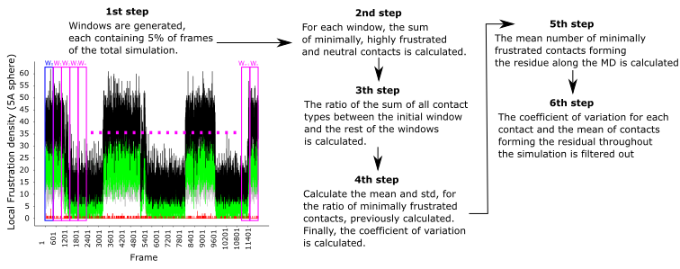

## A contact-based analysis of local energetic frustration dynamics identifies key residues enabling RfaH fold-switch 

### ABSTRACT
Fold-switching enables metamorphic proteins to reversibly interconvert between two highly dissimilar native states to regulate their protein functions. While about 100 proteins have been identified to undergo fold-switching, unveiling the key residues behind this mechanism for each protein remains challenging. Reasoning that fold-switching in proteins is driven by dynamic changes in local energetic frustration, we combined fold-switching simulations generated using simplified structure-based models (SBMs) with frustration analysis, to identify key residues involved in this process based on the change in the density of minimally frustrated contacts during refolding. Using this approach to analyze the fold-switch of the bacterial transcription factor RfaH, we identified 20 residues that significantly change their frustration during its fold-switch, some of which have been experimentally and computationally reported in previous works. Our approach, which we developed as an additional tool for the frustratometeR package, highlights the role of local frustration dynamics in protein fold-switching and offers a robust tool to enhance our understanding of other proteins with significant conformational shifts.

## Instructions

This GitHub contains the code of the windowing method for the frustration analysis of MD simulations of fold-switching in metamorphic proteins.

## Dependencies
- FrustratometeR R Package (https://github.com/proteinphysiologylab/frustratometeR/tree/master)
- Python librabries:
    - numpy
    - pandas

### How to run the pipeline

`python3 pipeline_for_frustration_clean.py path_to_pdbs path_to_results #frames #protein_length #sim_start`

Example:
`python3 pipeline_for_frustration_clean.py /home/pb3lab/Documents/rfah/ /home/pb3lab/Documents/rfah/results/ 162 0`

#sys.argv[1] -> path to pdbs files

#sys.argv[2] -> path where do you want to save the frustration results

#sys.argv[3] -> numbers of frames

#sys.argv[4] -> start frame
